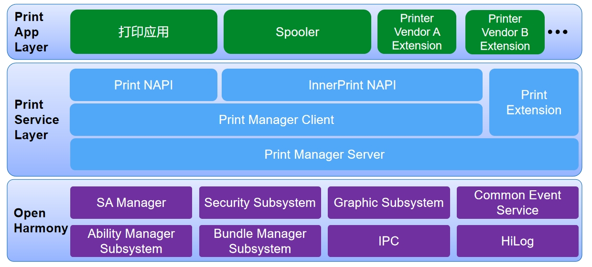
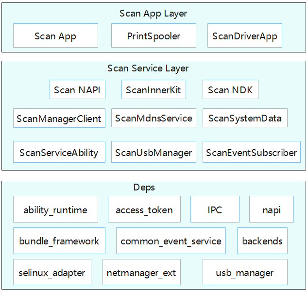
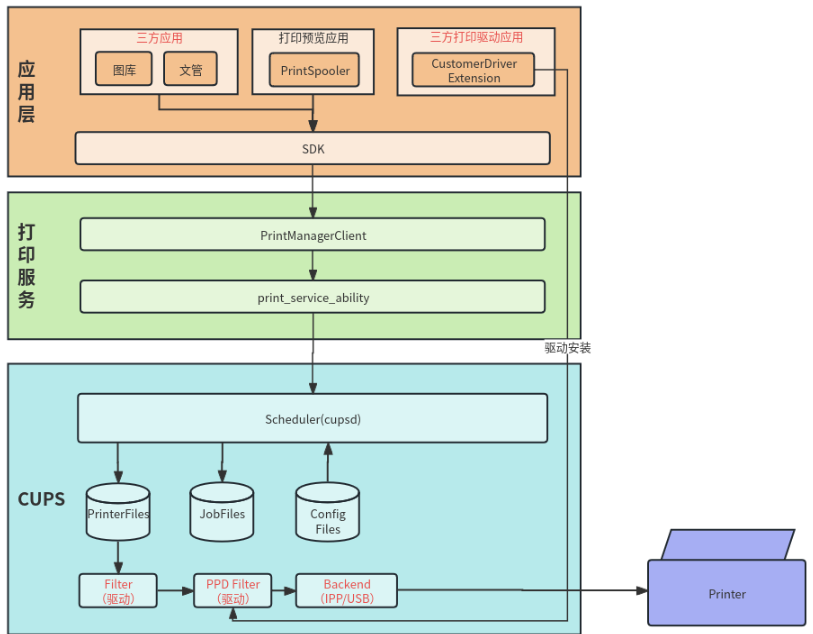
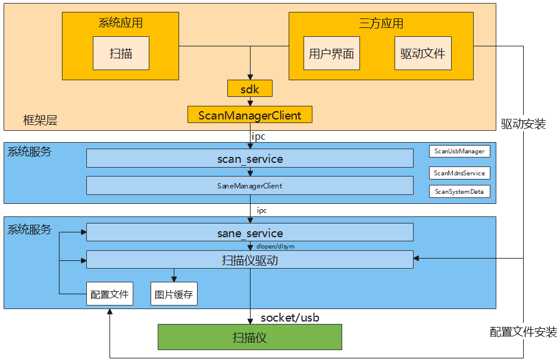

# 打印框架<a name="ZH-CN_TOPIC_0000001124232845"></a>

-   [简介](#section11660541593)
-   [目录](#section161941989596)
-   [约束](#section119744591305)
-   [说明](#section1312121216216)
-   [相关仓](#section1371113476307)

## 简介<a name="section11660541593"></a>

打印框架支持三方应用创建打印任务，拉起后台打印任务管理，管理打印扩展和打印任务。
提供打印扩展框架，实现三方打印扩展的接入，管理打印任务与打印机之间的关系，启动、取消打印任务，查询打印进度等。

打印框架提供了扫描能力，支持三方应用搜索和连接扫描仪，查询扫描仪能力，设置参数并启动扫描，完成扫描后可以获得扫描出的图片文件。

开发者可以基于[打印扫描驱动开发指南](https://gitee.com/openharmony/applications_print_spooler/blob/master/OpenHarmony%E6%89%93%E5%8D%B0%E6%89%AB%E6%8F%8F%E9%A9%B1%E5%8A%A8%E5%BC%80%E5%8F%91%E6%8C%87%E5%8D%971.8.md)开发打印机和扫描仪的驱动。

**图 1**  打印部件架构图<a name="fig371116145419"></a>



**图 2**  扫描部件架构图<a name="fig371116145420"></a>



**图 3**  打印流程图<a name="fig371116145421"></a>



打印逻辑流程如下：

首先，打印请求到打印框架，再从打印系统框架发送到打印预览界面（PrintSpooler），拉起打印预览界面到应用层。由PrintSpooler向打印服务(PrintSA)发送开启发现能力指令，再由PrintSA向打印扩展接口(PrintExtension)发送开启发现能力指令，然后PrintExtension向第三方打印扩展接口(CustomPrintExtension)发送开启发现能力发现打印机。CustomPrintExtension向打印服务（PrintServiceAbility）上报发现打印机信息并返回到PrintSpooler。由打印预览界面（PrintSpooler）发送打印任务到打印服务（PrintServiceAbility），再发送到打印扩展(PrintExtension)，之后发送给第三方打印扩展（CustomPrintExtension），再发送给打印机。

**图 4**  扫描流程图<a name="fig371116145422"></a>



扫描系统的后端是基于[SANE](https://gitee.com/openharmony/third_party_backends)开发的驱动，驱动提供连接扫描仪的能力。
三方应用通过驱动安装应用将驱动安装到系统沙箱，应用通过系统API调用扫描框架，由扫描服务加载后端驱动连接扫描仪。

## 目录<a name="section161941989596"></a>

```
foundation/print_print_fwk        #打印框架
├── frameworks       
│   └── innerkitsimpl             # Native接口
    └── kits\extension            # 打印扩展管理
├── interfaces\kits               # 接口层代码
│   └── jsnapi                     
        └── extension             # 管理扩展生命周期接口 
        └── extensionctx          # 管理扩展上下文
│   └── napi                      # JavaScript接口
├── services                      # 服务层代码
└── test                          # 测试用例资源
```

## 约束<a name="section119744591305"></a>

-   如需使用打印框架完整功能，需要申请code ohos.permission.PRINT、ohos.permission.MANAGE_PRINT_JOB权限。

## 说明<a name="section1312121216216"></a>
部件内子模块职责说明：
### 打印模块
-   **打印管理（Print NAPI）**

     对接打印应用的JS API，负责创建打印任务，监听打印任务状态变化等接口的实现

-   **打印管理（InnerPrint NAPI）**

     对接打印后台管理应用、三方打印扩展的内部JS API，负责打印机发现、预览、启动打印、监听打印机、打印任务状态变化等接口的实现

-   **打印管理客户端（Print Manager Client）**

    负责打印服务在客户端的接口实现，对外(JS应用或者Native应用）提供统一的打印服务能力

- **打印管理服务端（Print Manager Server）**

    对接打印管理，接受应用的打印任务相关请求，执行权限校验，并拉起后台打印任务管理；管理系统中打印扩展。包括打印扩展的新增、移除、修改属性（已安装的、默认的、当前使用的）、查询状态、监听变化等；管理打印任务队列。包括：打印格式化数据的传递、打印任务的数据缓存等；对接使用中的打印扩展，分发和管理打印任务

- **打印拓展（Print Extension）**

    打印扩展部分需要三方厂商定制

- **三方打印扩展（Custom Print Extension）**

    打印机厂商实现具体打印功能提供

- **打印后台管理应用（Printspooler）** 
  
    系统打印管理应用

### 扫描模块
-   **扫描js接口层（Scan NAPI）**

    对接扫描应用的JS-sdk，负责扫描系统接口的实现

-   **扫描c接口层（Scan CAPI)**

    对接扫描应用的c-sdk，负责扫描系统接口的实现

-   **扫描管理客户端（ScanManagerClient）**

    负责扫描服务在客户端的接口实现，对外(JS应用或者Native应用)提供统一的扫描服务能力

-   **扫描系统服务端（ScanServiceAbility）**

    对接扫描客户端，作为sane_service的客户端，将图片码流转成图片缓存

-   **扫描系统mdns服务（ScanMdnsService）**

    用于监控局域网内扫描仪的状态，更新局域网扫描仪的id

-   **扫描系统usb服务（ScanUsbManager）**

    用于监控usb扫描仪的状态，更新usb扫描仪的id

-   **扫描系统数据管理（ScanSystemData）**

    用于管理添加的扫描仪信息数据
    
-   **扫描系统驱动服务（SaneServerManager）**

    对接扫描系统服务端，加载扫描仪驱动，管理扫描驱动、扫描驱动缓存

## 相关仓<a name="section1371113476307"></a>

[cups](https://gitee.com/openharmony/third_party_cups)

[backends](https://gitee.com/openharmony/third_party_backends)

[applications_print_spooler](https://gitee.com/openharmony/applications_print_spooler)

## 参与贡献

[如何贡献](https://gitee.com/openharmony/docs/blob/HEAD/zh-cn/contribute/参与贡献.md)

[Commit message规范](https://gitee.com/openharmony/device_qemu/wikis/Commit%20message%E8%A7%84%E8%8C%83)