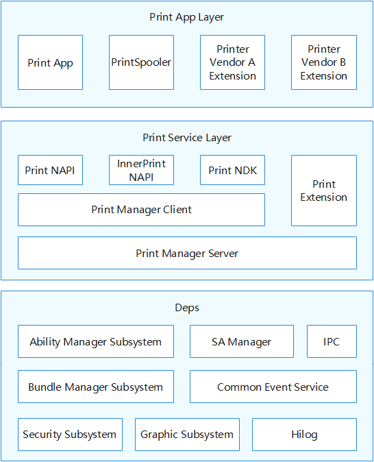

# 打印框架<a name="ZH-CN_TOPIC_0000001124232845"></a>

-   [简介](#section11660541593)
-   [目录](#section161941989596)
-   [约束](#section119744591305)
-   [说明](#section1312121216216)
-   [相关仓](#section1371113476307)

## 简介<a name="section11660541593"></a>

打印框架支持三方应用创建打印任务，拉起后台打印任务管理，管理打印扩展和打印任务。
提供打印扩展框架，实现三方打印扩展的接入，管理打印任务与打印机之间的关系，启动、取消打印任务，查询打印进度等。

逻辑流程如下：

首先，打印请求到打印框架，再从打印系统框架发送到打印预览界面（PrintSpooler），拉起打印预览界面到应用层。由PrintSpooler向打印服务(PrintSA)发送开启发现能力指令，再由PrintSA向打印扩展接口(PrintExtension)发送开启发现能力指令，然后PrintExtension向第三方打印扩展接口(CustomPrintExtension)发送开启发现能力发现打印机。CustomPrintExtension向打印服务（PrintServiceAbility）上报发现打印机信息并返回到PrintSpooler。由打印预览界面（PrintSpooler）发送打印任务到打印服务（PrintServiceAbility），再发送到打印扩展(PrintExtension)，之后发送给第三方打印扩展（CustomPrintExtension），再发送给打印机。

**图 1**  部件架构图<a name="fig371116145419"></a>




## 目录<a name="section161941989596"></a>

```
foundation/print_print_fwk        #打印框架
├── frameworks       
│   └── innerkitsimpl             # Native接口
    └── kits\extension            # 打印扩展管理
├── interfaces\kits               # 接口层代码
│   └── jsnapi                     
        └── extension             # 管理扩展生命周期接口 
        └── extensionctx          # 管理扩展上下文
│   └── napi                      # JavaScript接口
├── services                      # 服务层代码
└── test                          # 测试用例资源
```

## 约束<a name="section119744591305"></a>

-   如需使用打印框架完整功能，需要申请code ohos.permission.PRINT、ohos.permission.MANAGE_PRINT_JOB权限。

## 说明<a name="section1312121216216"></a>
部件内子模块职责说明：

-   **打印管理（Print NAPI）**

     对接打印应用的JS API，负责创建打印任务，监听打印任务状态变化等接口的实现

-   **打印管理（InnerPrint NAPI）**

     对接打印后台管理应用、三方打印扩展的内部JS API，负责打印机发现、预览、启动打印、监听打印机、打印任务状态变化等接口的实现

-   **打印管理客户端（Print Manager Client）**

    负责打印服务在客户端的接口实现，对外(JS应用或者Native应用）提供统一的打印服务能力

- **打印管理服务端（Print Manager Server）**

    对接打印管理，接受应用的打印任务相关请求，执行权限校验，并拉起后台打印任务管理；管理系统中打印扩展。包括打印扩展的新增、移除、修改属性（已安装的、默认的、当前使用的）、查询状态、监听变化等；管理打印任务队列。包括：打印格式化数据的传递、打印任务的数据缓存等；对接使用中的打印扩展，分发和管理打印任务

- **打印拓展（Print Extension）**

    打印扩展部分需要三方厂商定制

- **三方打印扩展（Custom Print Extension）**

    打印机厂商实现具体打印功能提供

- **打印后台管理应用（Printspooler）** 
  
    系统打印管理应用

## 相关仓<a name="section1371113476307"></a>
